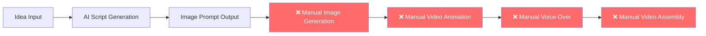
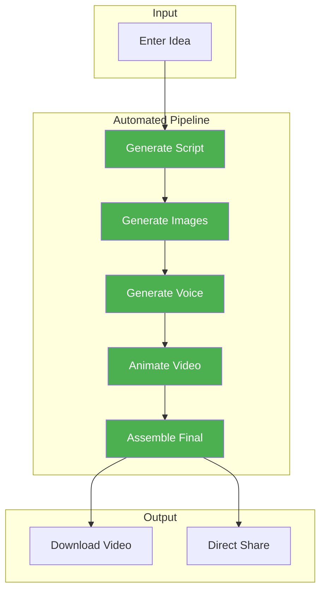

# 🎬 Video Script Generator - System Improvements & Recommendations

## 📋 Executive Summary

This document provides a comprehensive analysis of the current video production system and recommends additional tools, assistants, and improvements to **reduce production time** while maintaining **high visual quality** for monetizable social media content.

---

## 🔍 Current System Analysis

### Existing Capabilities

| Component | Function | Status |
|-----------|----------|--------|
| `generateAdviceScript` | Generates 5-sec video scripts with image prompts | ✅ Working |
| `generateImagePrompts` | Creates Pixar-style character prompts | ✅ Working |
| `generateVideoStory` | Multi-scene story generation with characters | ✅ Working |
| Firebase Integration | Data persistence | ✅ Working |
| OpenRouter API | LLM access (free models) | ✅ Working |

### Current Workflow Gaps



> [!WARNING]
> **Critical Gap**: The system generates prompts but requires manual execution of 4 major steps. This creates bottlenecks and inconsistency.

---

## 🚀 Recommended Improvements

### 1. 🖼️ Automated Image Generation Assistant

**Problem**: Currently outputs text prompts that require manual entry into external tools.

**Solution**: Integrate direct image generation APIs.

#### Recommended APIs (Free Tier Available)

| Service | Free Tier | Quality | Best For |
|---------|-----------|---------|----------|
| **getimg.ai** | 40 credits/day | High | Pixar/Disney styles |
| **Leonardo.ai** | 150 credits/day | Very High | Gaming/artistic images |
| **Ideogram** | 100/day | High | Text accuracy in images |
| **Stable Diffusion (via OpenArt)** | Unlimited basic | Medium-High | Customization |
| **Flux** | Open-source | High | Self-hosting |

#### Implementation

```javascript
// New service: src/services/imageGenerationService.js
export const generateImage = async (prompt, provider = 'getimg') => {
    const providers = {
        'getimg': 'https://api.getimg.ai/v1/stable-diffusion-xl/text-to-image',
        'leonardo': 'https://cloud.leonardo.ai/api/rest/v1/generations',
        'ideogram': 'https://api.ideogram.ai/generate'
    };
    // Implementation details...
};
```

**Impact**: 🕐 Saves 5-10 minutes per image

---

### 2. 🗣️ Egyptian Arabic Text-to-Speech Integration

**Problem**: Voice-overs are done manually by designers.

**Solution**: Integrate Egyptian dialect TTS APIs.

#### Recommended APIs

| Service | Free Tier | Egyptian Support | Quality |
|---------|-----------|------------------|---------|
| **EGTTS (Open Source)** | Unlimited | ✅ Native | High |
| **Lahajati** | 250 chars/trial | ✅ Cairene + Alexandrian | Very High |
| **ElevenLabs** | 10k chars/month | ✅ Accent | Premium |
| **Narakeet** | Limited | ✅ Khaled + Heba voices | High |
| **AiVOOV** | Free trial | ✅ Egypt accent | Medium |

#### Implementation

```javascript
// New service: src/services/ttsService.js
export const generateVoiceOver = async (text, options = {}) => {
    const {
        voice = 'egyptian_male',
        emotion = 'excited',
        speed = 1.0
    } = options;
    // Use EGTTS or Lahajati API
};
```

> [!TIP]
> **Recommended**: Use **EGTTS** (open-source) for development and **Lahajati** for production quality with authentic Egyptian dialects.

**Impact**: 🕐 Saves 3-5 minutes per voice clip

---

### 3. 🎥 AI Video Animation Integration

**Problem**: Image-to-video animation is done manually in external tools.

**Solution**: Integrate video generation APIs.

#### Recommended APIs

| Service | Free Tier | Quality | Duration |
|---------|-----------|---------|----------|
| **Runway ML Gen-2** | 125 credits | Premium | 4-16 sec |
| **Genmo (Mochi 1)** | Unlimited | Good | 3-5 sec |
| **Kling AI** | Limited | High | 5-10 sec |
| **Leonardo Motion** | Daily credits | High | 4 sec |
| **Steve.AI** | Watermarked | Good | Cartoon style |

#### Implementation

```javascript
// New service: src/services/videoAnimationService.js
export const animateImage = async (imageUrl, motionPrompt, duration = 5) => {
    // Use Genmo API (free) or Runway API (premium)
    const response = await fetch('https://api.genmo.ai/v1/video', {
        method: 'POST',
        body: JSON.stringify({
            image: imageUrl,
            prompt: motionPrompt,
            duration: duration
        })
    });
};
```

**Impact**: 🕐 Saves 10-20 minutes per video clip

---

### 4. 🎞️ Video Assembly Pipeline

**Problem**: Combining scenes into final video is manual.

**Solution**: Automated video stitching with transitions.

#### Recommended Tools

| Tool | Type | Best For |
|------|------|----------|
| **Shotstack API** | Cloud API | Full automation |
| **FFmpeg (via Node.js)** | Local | No API limits |
| **Remotion** | React-based | Programmatic videos |
| **Kapwing API** | Cloud | Quick assembly |

#### New Component: Video Assembly Page

```javascript
// New page: src/pages/VideoAssembly.jsx
// Features:
// - Drag & drop scene ordering
// - Add transitions (fade, slide, zoom)
// - Add background music
// - Preview before export
// - One-click export to MP4
```

**Impact**: 🕐 Saves 10-15 minutes per final video

---

### 5. 📚 Content Library & Templates

**Problem**: Starting from scratch each time.

**Solution**: Pre-built templates and asset library.

#### New Components

1. **Character Library**
   - Save generated characters for reuse
   - Consistent character across videos
   - Quick character selection

2. **Scene Templates**
   - Pre-designed scene layouts
   - Common storyline structures
   - Quick-start templates

3. **Voice Presets**
   - Saved voice settings
   - Emotion profiles
   - Speed variations

```javascript
// New service: src/services/libraryService.js
// - saveToLibrary(type, item)
// - loadFromLibrary(type, id)
// - searchLibrary(query)
```

---

### 6. 🔄 One-Click Pipeline

**Problem**: Multiple manual steps between pages.

**Solution**: Unified workflow with progress tracking.

#### New Page: Full Pipeline Generator



**Impact**: 🕐 Reduces total time from ~60 min to ~10 min per video

---

## 📊 Impact Summary

| Improvement | Time Saved | Implementation Effort |
|-------------|------------|----------------------|
| Auto Image Generation | 5-10 min/image | Medium |
| Egyptian TTS | 3-5 min/clip | Low |
| Video Animation | 10-20 min/video | Medium |
| Video Assembly | 10-15 min/final | High |
| Content Library | 5 min/project | Medium |
| One-Click Pipeline | 20+ min/video | High |

### Total Potential Time Savings

| Current Workflow | Optimized Workflow |
|------------------|-------------------|
| ~60 minutes/video | ~10-15 minutes/video |

> [!IMPORTANT]
> **ROI**: With these improvements, you can produce **4-6x more videos** in the same time frame, significantly increasing content output and monetization potential.

---

## 🛠️ Implementation Priority

### Phase 1: Quick Wins (1-2 weeks)

1. ✅ Integrate **getimg.ai** for image generation
2. ✅ Add **EGTTS** for Egyptian TTS
3. ✅ Add copy-to-clipboard for all outputs
4. ✅ Add image preview in the UI

### Phase 2: Core Automation (2-4 weeks)

1. 🔄 Integrate **Genmo/Runway** for video animation
2. 🔄 Build character/scene library
3. 🔄 Add FFmpeg-based video assembly

### Phase 3: Full Pipeline (4-6 weeks)

1. 📦 One-click full pipeline
2. 📦 Batch processing
3. 📦 Direct social media upload
4. 📦 Analytics dashboard

---

## 💰 Cost Analysis

### Free Tier Strategy

| Service | Monthly Free Limit | Est. Videos/Month |
|---------|-------------------|-------------------|
| OpenRouter (LLM) | Varies by model | Unlimited with free models |
| getimg.ai | 1200 images/month | ~200-400 videos |
| EGTTS | Unlimited | Unlimited |
| Genmo | Unlimited (480p) | Unlimited |

> [!TIP]
> **Budget Option**: Using all free tiers, you can produce **200+ videos/month at $0 cost**.

### Premium Upgrade Path

| When to Upgrade | Service | Est. Cost |
|-----------------|---------|-----------|
| Need 1080p+ | Runway ML | $12-76/month |
| High-quality TTS | ElevenLabs | $5-22/month |
| Fast processing | getimg.ai Pro | $12/month |

---

## 🔧 Technical Requirements

### New Dependencies

```json
{
  "dependencies": {
    "fluent-ffmpeg": "^2.1.2",
    "sharp": "^0.32.0",
    "axios": "^1.6.0"
  }
}
```

### New Environment Variables

```env
# Image Generation
GETIMG_API_KEY=your_key
LEONARDO_API_KEY=your_key

# Text-to-Speech
EGTTS_API_KEY=your_key
ELEVENLABS_API_KEY=your_key

# Video Generation
RUNWAY_API_KEY=your_key
GENMO_API_KEY=your_key
```

---

## 📁 New File Structure

```
src/
├── services/
│   ├── openRouterService.js (existing)
│   ├── firebaseService.js (existing)
│   ├── imageGenerationService.js (NEW)
│   ├── ttsService.js (NEW)
│   ├── videoAnimationService.js (NEW)
│   └── videoAssemblyService.js (NEW)
├── components/js/
│   ├── ... (existing)
│   ├── CharacterLibrary.jsx (NEW)
│   ├── SceneTemplates.jsx (NEW)
│   ├── VoiceOverGenerator.jsx (NEW)
│   └── VideoAssembly.jsx (NEW)
└── pages/
    ├── ... (existing)
    └── FullPipeline.jsx (NEW)
```

---

## ✅ Next Steps

1. **Review this document** and prioritize improvements
2. **Choose APIs** based on budget (free vs paid)
3. **Start with Phase 1** for immediate impact
4. **Test with real content** before full rollout

---

> [!NOTE]
> This analysis is based on publicly available API information as of February 2026. API availability and pricing may change.
